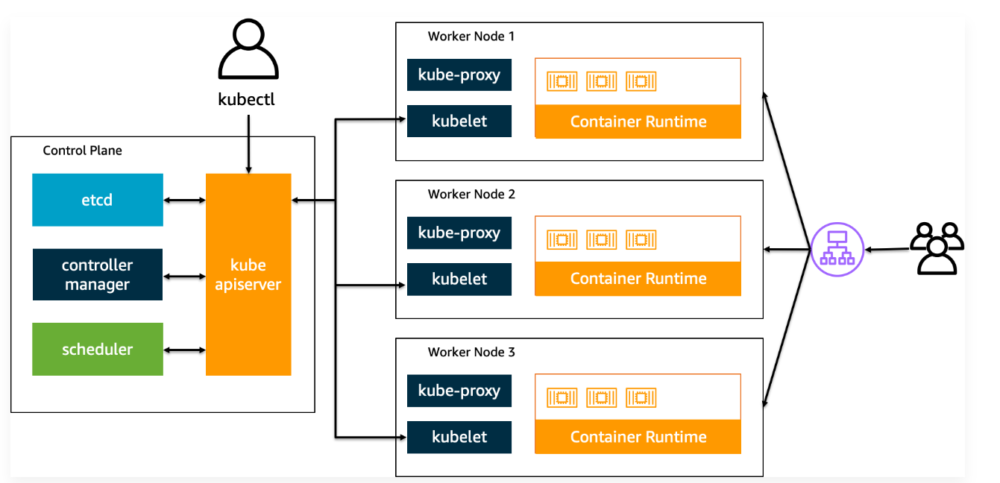
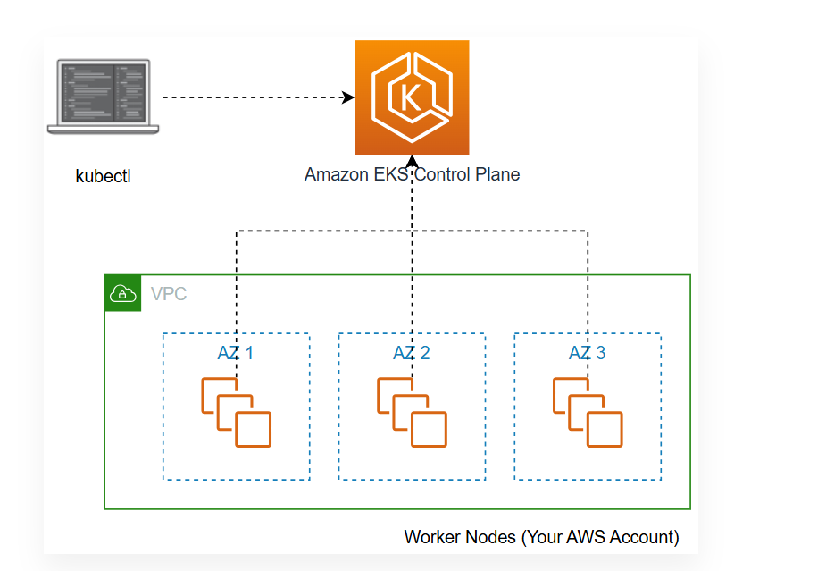
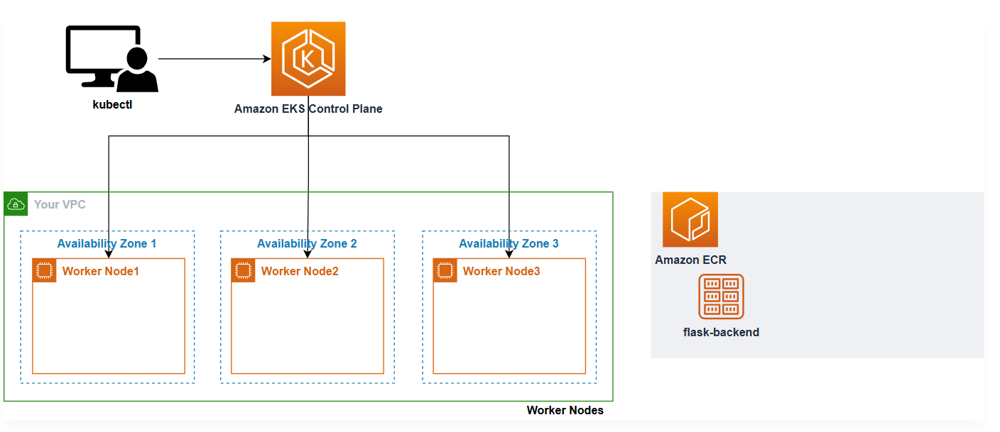

### Kubernetes Cluster Architecture



### EKS Cluster Architecture



---
``` 
    - Install kubectl
    - Install eksctl
```

### EKS Cluster Creation
---
```yaml
apiVersion: eksctl.io/v1alpha5
kind: ClusterConfig

metadata:
  name: eks-demo
  region: ${AWS_REGION}
  version: "1.33"

vpc:
  cidr: "10.0.0.0/16"
  nat:
    gateway: Single

managedNodeGroups:
  - name: node-group
    instanceType: m5.large
    desiredCapacity: 3
    volumeSize: 20
    privateNetworking: true
    iam:
      withAddonPolicies:
        imageBuilder: true
        cloudWatch: true
        autoScaler: true
        ebs: true

cloudWatch:
  clusterLogging:
    enableTypes: ["*"]
```
---
🔹 apiVersion: eksctl.io/v1alpha5  
This specifies the version of the eksctl configuration format.  
  
v1alpha5 is the latest supported version that includes all the current features.

🔹 kind: ClusterConfig  
This tells eksctl that the file describes a cluster configuration.

🔹 metadata  
Basic metadata for the EKS cluster.

---
```yaml
name: eks-demo
region: ${AWS_REGION}
version: "1.33"
```

- `name`: Name of the EKS cluster.  
- `region`: AWS region to deploy the cluster in (e.g., us-east-1, ap-south-1). Here, it uses a placeholder `${AWS_REGION}` — ensure this is set in your shell before running eksctl.  
- `version`: Kubernetes version (1.33 here).
🔹 vpc

```yaml
cidr: "10.0.0.0/16"
nat:
  gateway: Single
```

Specifies custom VPC settings:

- `cidr`: IP range for the VPC.  
- `nat.gateway: Single`: A single NAT Gateway will be used to allow private subnets to access the internet (needed for `privateNetworking: true`).

🔹 managedNodeGroups

```yaml
- name: node-group
  instanceType: m5.large
  desiredCapacity: 3
  volumeSize: 20
  privateNetworking: true
  iam:
    withAddonPolicies:
      imageBuilder: true
      cloudWatch: true
      autoScaler: true
      ebs: true
```

Defines a Managed Node Group for the EKS cluster (i.e., a group of EC2 instances that will run your Kubernetes workloads):

- `name`: Identifier for this node group.  
- `instanceType`: EC2 instance type (`m5.large` = 2 vCPU, 8 GB RAM).  
- `desiredCapacity`: Number of EC2 worker nodes to start with (here 3).  
- `volumeSize`: Size of the root EBS volume (in GB).  
- `privateNetworking: true`: Nodes will not have public IPs; they’ll be placed in private subnets.  
- `iam.withAddonPolicies`: Enables IAM policies for common add-ons:  
  - `imageBuilder`: For building container images.  
  - `cloudWatch`: To allow node logs to go to Amazon CloudWatch.  
  - `autoScaler`: To allow the Kubernetes Cluster Autoscaler to function.  
  - `ebs`: Allows the use of Amazon EBS volumes in pods.

🔹 cloudWatch

```yaml
clusterLogging:
  enableTypes: ["*"]
```

Enables cluster-level logging via Amazon CloudWatch.

- `enableTypes: ["*"]`: Enables all types of cluster logs (`api`, `audit`, `authenticator`, `controllerManager`, `scheduler`, etc.).

```
eksctl create cluster -f eks-demo-cluster.yaml
```
---
After creating a Kubernetes cluster with eksctl, the architecture of the services configured as of now is shown below.




✅ **Summary:**  
This config will:

- Create an EKS cluster named `eks-demo` in the specified region.  
- Use Kubernetes version 1.33.  
- Set up a VPC with NAT gateway and private subnets.  
- Launch a node group with 3 `m5.large` instances, all in private subnets.  
- Enable IAM policies for various AWS add-ons.  
- Enable full cluster logging to CloudWatch.

---
### Create AWS Load Balancer Controller

```
The AWS Load Balancer Controller  manages AWS Elastic Load Balancers for a Kubernetes cluster. The controller provisions the following resources.

1. It satisfies Kubernetes 'Ingress' resources by provisioning Application Load Balancers.
2. It satisfies Kubernetes 'Service' resources by provisioning Network Load Balancers.

The controller was formerly named the AWS ALB Ingress Controller. There are two traffic modes supported by each type of AWS Load Balancer controller:

 - Instance(default): Register nodes in the cluster as targets for ALB. Traffic reaching the ALB is routed to NodePort and then proxied to the Pod.
 - IP: Register the Pod as an ALB target. Traffic reaching the ALB is routed directly to the Pod. In order to use that traffic mode, you must explicitly specify it in the ingress.yaml file with comments.

```

Before deploying the AWS Load Balancer controller, we need to do some things. Because the controller operates over the worker node, you must make it accessible to AWS ALB/NLB resources through IAM permissions. IAM permissions can install IAM Roles for ServiceAccount or attach directly to IAM Roles on the worker node.

```
```
1. First, create IAM OpenID Connect (OIDC) identity provider for the cluster. IAM OIDC provider must exist in the cluster(in this lab, eks-demo) in order for objects created by Kubernetes to use service account  which purpose is to authenticate to API Server or external services.

```bash
eksctl utils associate-iam-oidc-provider \
    --region ${AWS_REGION} \
    --cluster eks-demo \
    --approve
```

```
Check the OIDC provider URL of the cluster through the commands below.

```
```bash
aws eks describe-cluster --name eks-demo --query "cluster.identity.oidc.issuer" --output text
```

```
2. Create an IAM Policy to grant to the AWS Load Balancer Controller.
```
```bash
curl -O https://raw.githubusercontent.com/kubernetes-sigs/aws-load-balancer-controller/v2.13.3/docs/install/iam_policy.json
```
```bash
aws iam create-policy \
    --policy-name AWSLoadBalancerControllerIAMPolicy \
    --policy-document file://iam_policy.json
```
```
Create ServiceAccount for AWS Load Balancer Controller.
```
```bash
eksctl create iamserviceaccount \
    --cluster eks-demo \
    --namespace kube-system \
    --name aws-load-balancer-controller \
    --attach-policy-arn arn:aws:iam::$ACCOUNT_ID:policy/AWSLoadBalancerControllerIAMPolicy \
    --override-existing-serviceaccounts \
    --region ${AWS_REGION} \
    --approve
```
When deploying an EKS cluster, you can also add the IAM policy associated with the AWS Load Balancer Controller to the Worker node in the form of Addon. However, in this lab, we will conduct with the reference

https://kubernetes-sigs.github.io/aws-load-balancer-controller/latest/deploy/installation/

# 🚀 Installing AWS Load Balancer Controller on Amazon EKS

This guide walks through setting up the **AWS Load Balancer Controller** in an EKS cluster using `kubectl`.

---

## 📌 Prerequisites

- An existing EKS cluster (e.g., `eks-demo`)
- `kubectl` configured to interact with your cluster
- IAM Role for the AWS Load Balancer Controller with appropriate policies (already created and annotated to ServiceAccount)
- OIDC provider associated with your EKS cluster
- `cert-manager` installed

---

## ✅ Step 1: Install cert-manager

`cert-manager` is required for provisioning TLS certificates used by the AWS Load Balancer Controller’s webhooks.

```bash
kubectl apply --validate=false -f https://github.com/cert-manager/cert-manager/releases/download/v1.12.3/cert-manager.yaml
```

- `--validate=false`: skips schema validation since this file includes CustomResourceDefinitions (CRDs).
- cert-manager will install into the `cert-manager` namespace and handle TLS for the controller's webhooks.

---

## ✅ Step 2: Download the AWS Load Balancer Controller Manifest

```bash
curl -Lo v2_13_3_full.yaml https://github.com/kubernetes-sigs/aws-load-balancer-controller/releases/download/v2.13.3/v2_13_3_full.yaml
```

This YAML file includes:
- Deployment
- ClusterRole/Bindings
- Webhook configurations
- CRDs
- ServiceAccount

---

## ✅ Step 3: Remove the ServiceAccount Section

Remove the ServiceAccount lines to avoid overwriting the IAM annotation you added earlier:

```bash
sed -i.bak -e '730,738d' ./v2_13_3_full.yaml
```

- This preserves your IAM role association with the controller’s ServiceAccount in the `kube-system` namespace.

---

## ✅ Step 4: Update the Cluster Name

Replace the placeholder `your-cluster-name` with your actual EKS cluster name (`eks-demo` in this case):

```bash
sed -i.bak -e 's|your-cluster-name|eks-demo|' ./v2_13_3_full.yaml
```

---

## ✅ Step 5: Apply the Load Balancer Controller YAML

```bash
kubectl apply -f v2_13_3_full.yaml
```

This installs the AWS Load Balancer Controller and its dependencies into the `kube-system` namespace.

---

## ✅ Step 6: Add IngressClass and IngressClassParams

Download and apply the IngressClass configuration:

```bash
curl -Lo v2_13_3_ingclass.yaml https://github.com/kubernetes-sigs/aws-load-balancer-controller/releases/download/v2.13.3/v2_13_3_ingclass.yaml

kubectl apply -f v2_13_3_ingclass.yaml
```

This tells Kubernetes to use the AWS Load Balancer Controller for managing ingress resources.

---

## ✅ Step 7: Verify the Deployment

Check that the controller is running:

```bash
kubectl get deployment -n kube-system aws-load-balancer-controller
```

You should see output similar to:

```
NAME                          READY   UP-TO-DATE   AVAILABLE   AGE
aws-load-balancer-controller  1/1     1            1           1m
```

---

## ✅ Step 8: Verify the ServiceAccount

Ensure your ServiceAccount has the proper IAM annotation:

```bash
kubectl get sa aws-load-balancer-controller -n kube-system -o yaml
```

Check for this annotation in the output:
```yaml
annotations:
  eks.amazonaws.com/role-arn: arn:aws:iam::<ACCOUNT_ID>:role/<ROLE_NAME>
```
---

```
Pods running inside the cluster for the necessary functions are called Addon. Pods used for add-on are managed by the Deployment, Replication Controller, and so on. And the namespace that this add-on uses is kube-system. Because the namespace is specified as kube-system in the yaml file, it is successfully deployed when the pod name is derived from the command above. You can also check the relevant logs with the commands below.
```

```bash
kubectl logs -n kube-system $(kubectl get po -n kube-system | egrep -o "aws-load-balancer[a-zA-Z0-9-]+")
```

```
Detailed property values are available with the commands below.
```

```bash
ALBPOD=$(kubectl get pod -n kube-system | egrep -o "aws-load-balancer[a-zA-Z0-9-]+")
kubectl describe pod -n kube-system ${ALBPOD}
```

## 🎯 Result

You can now create Ingress resources using the AWS Load Balancer Controller. The controller will automatically provision and manage **Application Load Balancers (ALBs)** or **Network Load Balancers (NLBs)** in your AWS account based on your Kubernetes manifests.

---

## 📚 References

- [AWS Load Balancer Controller GitHub](https://github.com/kubernetes-sigs/aws-load-balancer-controller)
- [cert-manager Documentation](https://cert-manager.io/docs/)
- [AWS EKS Ingress Setup Guide](https://docs.aws.amazon.com/eks/latest/userguide/aws-load-balancer-controller.html)

```
git clone https://github.com/joozero/amazon-eks-flask.git
git clone https://github.com/joozero/amazon-eks-frontend.git

from these two links we need to build the images and push it to ECR
```